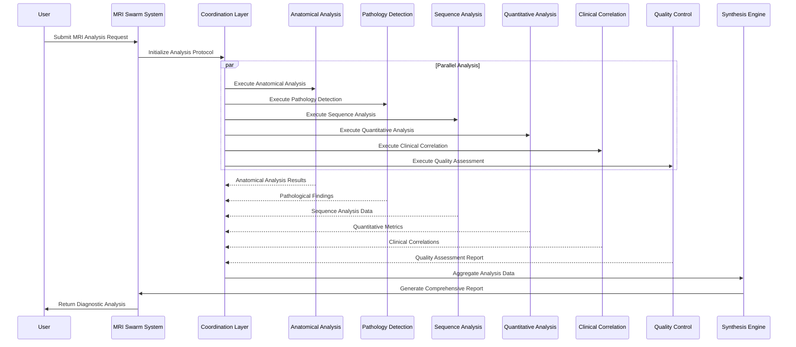

# MRI-Swarm

A powerful MRI analysis system using swarm intelligence and specialized agents.

## Features

- Collaborative AI agents for comprehensive MRI analysis
- Multiple specialized agents (anatomical, pathological, sequence, etc.)
- Support for single and batch image processing
- Production-ready REST API
- Docker support for easy deployment

## Documentation

- [API Documentation](docs/api.md) - Comprehensive guide for using the MRI-Swarm API
- [Installation Guide](docs/installation.md) - Instructions for setting up MRI-Swarm
- [Development Guide](docs/development.md) - Guide for developers contributing to MRI-Swarm

## Quick Start

1. Clone the repository:
```bash
git clone https://github.com/yourusername/MRI-Swarm.git
cd MRI-Swarm
```

2. Set up environment variables:
```bash
# Copy the example env file
cp env.example .env

# Edit the .env file with your settings
# REQUIRED: Add your Anthropic API key
ANTHROPIC_API_KEY=your_key_here
```

3. Run with Docker:
```bash
# Build the image
docker build -t mri-swarm .

# Run with environment variables
docker run -p 8000:8000 \
  --env-file .env \
  -v $(pwd)/logs:/app/logs \
  -v $(pwd)/uploads:/app/uploads \
  mri-swarm
```

Or run locally:
```bash
pip install -r requirements.txt
export ANTHROPIC_API_KEY=your_key_here
python -m uvicorn api:app --host 0.0.0.0 --port 8000
```

## Environment Variables

Required:
- `ANTHROPIC_API_KEY`: Your Anthropic API key for Claude

Optional:
- `PORT`: Server port (default: 8000)
- `HOST`: Server host (default: 0.0.0.0)
- `WORKERS`: Number of Gunicorn workers (default: 4)
- `ENVIRONMENT`: development or production (default: production)
- `LOG_LEVEL`: Logging level (default: info)
- `CORS_ORIGINS`: List of allowed CORS origins

## License

This project is licensed under the terms of the LICENSE file included in the repository.

## Contributing

We welcome contributions from the medical imaging and software development community. Please submit pull requests following our contribution guidelines.

## Agent Architecture

The system comprises six specialized medical imaging agents and one synthesis agent:

1. **Anatomical Analysis Agent**
   - Precise anatomical structure identification
   - Advanced brain region mapping and segmentation
   - Multi-tissue classification system

2. **Pathology Detection Agent**
   - Advanced tumor detection and classification
   - Comprehensive lesion identification
   - Disease marker evaluation protocol

3. **Sequence Analysis Agent**
   - T1/T2 weighted image interpretation
   - FLAIR sequence analysis
   - Diffusion-weighted imaging interpretation

4. **Quantitative Analysis Agent**
   - High-precision volumetric measurements
   - Signal intensity quantification
   - Advanced statistical analysis

5. **Clinical Correlation Agent**
   - Systematic symptom correlation
   - Treatment response assessment
   - Evidence-based outcome prediction

6. **Quality Control Agent**
   - Comprehensive image quality assessment
   - Systematic artifact detection
   - Protocol compliance verification

7. **Synthesis Agent**
   - Integration of diagnostic findings
   - Generation of comprehensive medical reports
   - Evidence-based diagnostic recommendations

## System Operation

1. User submits an MRI analysis task with imaging data
2. System initiates a coordinated analysis protocol
3. Specialized agents perform targeted analysis
4. Agents exchange diagnostic insights
5. Synthesis agent integrates findings
6. System generates comprehensive diagnostic report

## Implementation Examples

```python
# Case 1: Tumor Analysis
result = mri_swarm(
    task="Analyze this brain MRI for presence and characteristics of any tumors",
    img="tumor_case.jpg"
)

# Case 2: Multiple Sclerosis Assessment
result = mri_swarm(
    task="Evaluate these MRI sequences for MS lesions and disease progression",
    imgs=["ms_baseline.jpg", "ms_followup.jpg"]
)

# Case 3: Quality Assessment
result = mri_swarm(
    task="Assess the quality of this MRI scan and identify any artifacts",
    img="scan_quality_check.jpg"
)
```

## System Architecture Diagram



## API Usage

[Learn more here on how to run the API with fastapi and gunicorn](./docs/api.md)

### Production Deployment Notes

1. Configure CORS appropriately in `api.py`
2. Set up SSL certificates
3. Configure appropriate user/group in `gunicorn_config.py`
4. Set up proper logging rotation
5. Use environment variables for sensitive configuration
