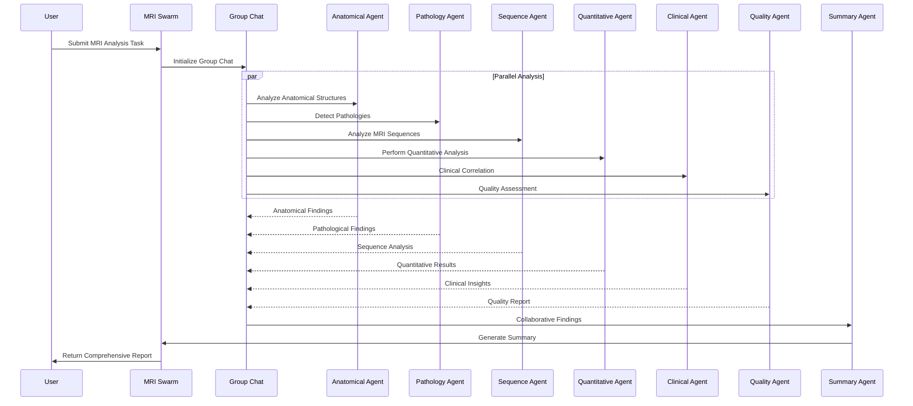

# MRI Swarm 🧠

MRI Swarm is a powerful collaborative AI system designed for comprehensive MRI scan analysis. It leverages a swarm of specialized AI agents, each focusing on different aspects of MRI interpretation, to provide detailed and accurate analysis of medical imaging data.

## 🌟 Features

- **Multi-Agent Collaboration**: Six specialized agents working together to analyze MRI scans
- **Comprehensive Analysis**: From anatomical structure to clinical correlation
- **Quality Control**: Built-in quality assessment and artifact detection
- **Automated Reporting**: Generates detailed summaries with potential diagnoses
- **Flexible Input**: Supports single or multiple MRI image analysis

## 🔧 Installation

```bash
pip install -r requirements.txt
```

## 🚀 Quick Start

```python
from mri_swarm import mri_swarm

# Analyze a single MRI scan
result = mri_swarm(
    task="Analyze this brain MRI for signs of multiple sclerosis",
    img="path/to/brain_mri.jpg"
)
print(result)

# Analyze multiple MRI scans
results = mri_swarm(
    task="Compare these brain MRIs for progression of tumor",
    imgs=["scan1.jpg", "scan2.jpg"]
)
print(results)
```

## 🤖 Agent Architecture

The system consists of six specialized agents and one summary agent:

1. **Anatomical Analysis Agent**
   - Anatomical structure identification
   - Brain region mapping and segmentation
   - Tissue type classification

2. **Pathology Detection Agent**
   - Tumor detection and classification
   - Lesion identification
   - Disease marker evaluation

3. **Sequence Analysis Agent**
   - T1/T2 weighted image interpretation
   - FLAIR sequence analysis
   - Diffusion-weighted imaging analysis

4. **Quantitative Analysis Agent**
   - Volumetric measurements
   - Signal intensity quantification
   - Statistical analysis

5. **Clinical Correlation Agent**
   - Symptom correlation
   - Treatment response assessment
   - Clinical outcome prediction

6. **Quality Control Agent**
   - Image quality assessment
   - Artifact detection
   - Protocol compliance verification

7. **Summary Agent**
   - Consolidates findings
   - Generates comprehensive reports
   - Provides diagnostic suggestions

## 📊 How It Works

1. User submits an MRI analysis task with image(s)
2. The swarm initiates an interactive group chat
3. Specialized agents analyze different aspects of the scan
4. Agents collaborate and share insights
5. Summary agent consolidates findings
6. System returns comprehensive analysis report

## 🎯 Use Cases

```python
# Case 1: Tumor Analysis
result = mri_swarm(
    task="Analyze this brain MRI for presence and characteristics of any tumors",
    img="tumor_case.jpg"
)

# Case 2: Multiple Sclerosis Assessment
result = mri_swarm(
    task="Evaluate these MRI sequences for MS lesions and disease progression",
    imgs=["ms_baseline.jpg", "ms_followup.jpg"]
)

# Case 3: Quality Assessment
result = mri_swarm(
    task="Assess the quality of this MRI scan and identify any artifacts",
    img="scan_quality_check.jpg"
)
```

## 🔄 Workflow Diagram



## 📄 License

This project is licensed under the terms of the LICENSE file included in the repository.

## 🤝 Contributing

Contributions are welcome! Please feel free to submit a Pull Request.
